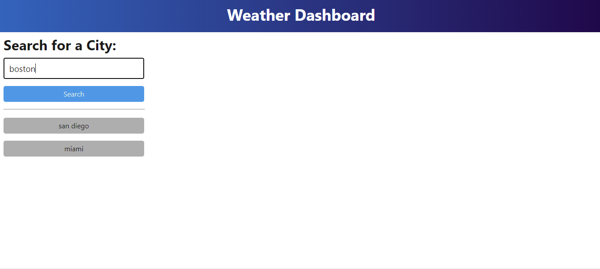
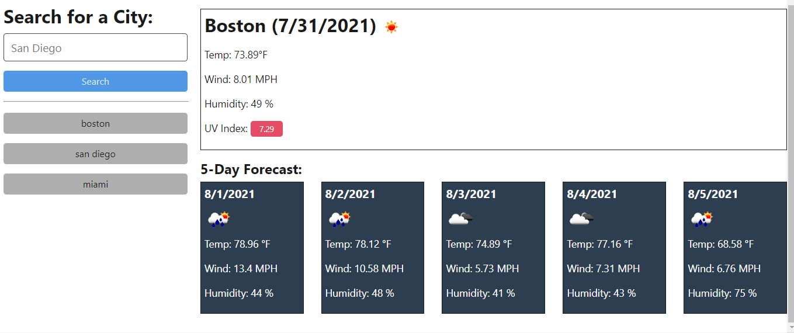

# Weather Dashboard

## Description

This webpage is a weather forecast for the city of your choice. It will allow you to input the name of the city on the search bar and it will bring up today´s weather as well as the weather forecast for the next 5 days.
Any city you search for will be saved and will bring up a button beneath the search bar which will allow you to quickly view your past searches.


## Table of Contents 

* [Installation](#installation)

* [Usage](#usage)

* [Questions](#questions)

## Installation

To install necessary dependencies, run the following command:

```
npm i
```

## Usage

To use the web app, you just have to input the name of the city you want to know the weather of, and hit the search button.



This will display the weather conditions for that city, along with a 5 day weather forecast.



After searching for a city, a button will be added below the search bar to easily check past searches.

## Questions

If you have any questions about the repo, open an issue or contact me directly at delalama.7@gmail.com. You can find more of my work at [adelalama](https://github.com/adelalama/).

